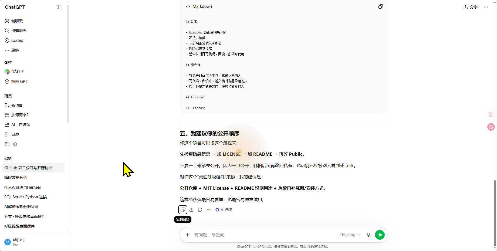
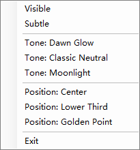

# Breathe

Windows 桌面呼吸提醒小组件：以透明悬浮窗的方式，用轻柔的呼吸动画提醒你注意节奏、放松身体，尽量不打扰当前工作。

技术实现与英文说明见 [`win/README.md`](win/README.md)。

## 直接下载使用（推荐）

**无需安装 .NET**：从 [GitHub Releases](https://github.com/811185895/breathe/releases/latest) 下载 **`BreatheWidget-v*-win-x64-portable.zip`**（文件名中的版本号随发布变化），解压到任意文件夹后，双击 **`BreatheWidget.App.exe`** 即可运行。

说明：

- 当前发布包为 **自包含（self-contained）** 的 **64 位（x64）** Windows 构建，已内含运行时，**不需要**再安装 .NET SDK 或运行时。
- 解压后文件夹内会有较多 DLL 与语言子目录，这是正常现象；请**保留整份解压结果**，不要只拷贝单个 exe。
- 首次启动可能比后续稍慢（运行时加载）；若安全软件拦截，请选择「允许」或自行校验 Release 附件哈希（可选）。
- 若你使用 **ARM 版 Windows** 或 **32 位系统**，当前官方 Release 未单独打包，可自行在仓库里 `dotnet publish`（见下文）或提需求。

## 从源码运行（开发者）

适合要改代码或参与贡献的同学。需要先安装 **[.NET 8 SDK](https://dotnet.microsoft.com/download/dotnet/8.0)**。

```powershell
git clone https://github.com/811185895/breathe.git
cd breathe\win
dotnet run --project BreatheWidget.App\BreatheWidget.App.csproj
```

### 托盘菜单能做什么

右键托盘图标可以：

- 显示 / 隐藏 / 弱化（`Visible`、`Subtle`）
- 切换色调模式
- 调整位置（如居中、下三分之一、黄金分割点附近等）
- 退出（`Exit`）

更细的交互说明见 [`win/README.md`](win/README.md)。

## 自行打包便携版（本地）

已安装 .NET 8 SDK 时，可在 `win` 目录执行：

```powershell
cd breathe\win
dotnet publish BreatheWidget.App\BreatheWidget.App.csproj `
  -c Release -r win-x64 --self-contained true `
  -p:DebugType=None -p:DebugSymbols=false `
  -o .\publish-out
```

在 `publish-out` 中运行 **`BreatheWidget.App.exe`** 即可，可将整个文件夹打成 zip 分享。

## 维护者：如何发版并触发 Release

1. 确认 `main`（或默认分支）已包含 `.github/workflows/release.yml`。
2. 打一个以 **`v` 开头的标签**（建议语义化版本，例如 `v1.0.0`）并推送：

   ```powershell
   git tag v1.0.0
   git push origin v1.0.0
   ```

3. GitHub Actions 会在 **Windows** _runner_ 上执行 `dotnet publish`（自包含 win-x64）、打 zip，并在该标签下创建 **Release** 并上传附件。

## 构建与测试

```powershell
cd breathe\win
dotnet build BreatheWidget.sln
dotnet run --project BreatheWidget.Tests\BreatheWidget.Tests.csproj
```

## 使用效果

### 截图





### 视频（呼吸动画）

下面内嵌视频主要展示桌面上的**呼吸渐变 / 氛围动画**实际效果。当前这一段录屏里**还没有**「文字提醒」相关效果（之后若单独做了文字类提示，会再补一版录屏说明）。

GitHub 的 README 会过滤指向**仓库内相对路径**的 `<video>`，所以在页面上能直接播放的地址使用 **Releases 里的附件**（与便携 zip 同一批上传，文件名固定为 `breathing-demo.mp4`）：

<video controls width="100%">
  <source src="https://github.com/811185895/breathe/releases/latest/download/breathing-demo.mp4" type="video/mp4">
</video>

若内嵌播放器仍无法加载（例如企业网络拦截 `github.com` 下载域），可改用 [Releases 最新页](https://github.com/811185895/breathe/releases/latest) 手动下载 **`breathing-demo.mp4`**，或在仓库中查看源文件 [`docs/breathing-demo.mp4`](docs/breathing-demo.mp4)。

## 开源与公开仓库前的提醒

公开仓库前请确认代码与历史中无密钥、内网地址等敏感信息。发版流程与协议选择可参考 [`docs/开源/开源操作方案--ChatGPT.md`](docs/开源/开源操作方案--ChatGPT.md)。

## License

[MIT](LICENSE)
